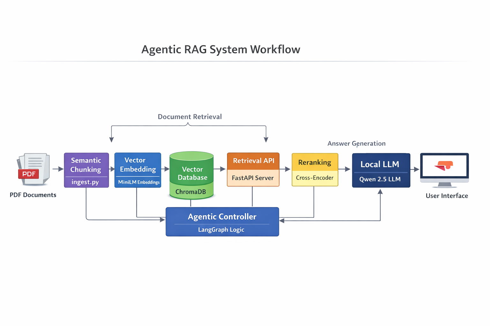

# 🏆 LLM-Based Agentic AI Engine

> **Champion – EWU Innovation Challenge 2026**  
> 🏅 **Winner** of the *“LLM-Based AI Engine Development” Innovation Challenge*  
> Organized by **East West University Robotics Club**


-purple?style=flat)


---

## 📖 Overview

This project is a **fully offline, privacy-first Agentic Retrieval-Augmented Generation (RAG) system** designed to analyze and answer complex policy and regulatory documents with **high factual precision** and **strict grounding**.

The system was developed to solve a real institutional problem:

> 📘 **Accurately querying the East West University Disciplinary Code**  
> *Goal: Provide answers without hallucination, external APIs, or privacy risks.*

---

## 🖼️ Demo (Web Interface)


---

## 🏗️ System Architecture



---

## 🚀 Key Features

### 🧠 Agentic Workflow (LangGraph)
A multi-step graph agent that performs:
- keyword extraction for better policy retrieval
- retrieval and re-ranking
- optional tool execution
- strict grounded answer generation

### 🔍 Hybrid Retrieval Pipeline (Retrieve + Re-rank)
- **Vector search** using **ChromaDB**
- **Cross-Encoder re-ranking** for clause-level precision
- returns only the most relevant policy clauses to the generator

### 🔐 Privacy-First & Fully Offline
- Runs with a **local GGUF LLM** via **llama-cpp-python**
- No cloud inference / no external APIs required

### 📚 PDF Ingestion Pipeline
- PDF loading: **PyPDFLoader**
- chunking: **RecursiveCharacterTextSplitter**
- embeddings: `sentence-transformers/all-MiniLM-L6-v2`
- persistent store: `chroma_db/`

---

## 🧰 Tech Stack

- **Frontend:** Streamlit  
- **Agent Orchestration:** LangGraph  
- **Backend / Tool Server:** FastAPI + Uvicorn  
- **Vector DB:** ChromaDB  
- **Embeddings:** `sentence-transformers/all-MiniLM-L6-v2`  
- **Re-ranking:** `cross-encoder/ms-marco-MiniLM-L-6-v2`  
- **Local LLM runtime:** `llama-cpp-python` (GGUF model)

---

## ⚙️ How to Run (Local)

### 1) Ingest PDFs into Chroma
Put PDFs in `data/pdfs/`, then run:

```bash
python ingest.py
```

### 2) Start the tool server
```bash
python server.py
# or:
uvicorn server:app --host 0.0.0.0 --port 8000
```

### 3) Start the Streamlit UI
```bash
streamlit run app.py
```

---

## 📌 Notes

- The generator is instructed to answer **strictly from retrieved context**.
- If the retrieved context does not contain the answer, the assistant responds:  
  **"I don't know based on the provided documents."**
